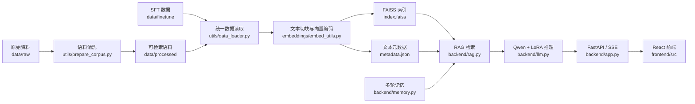
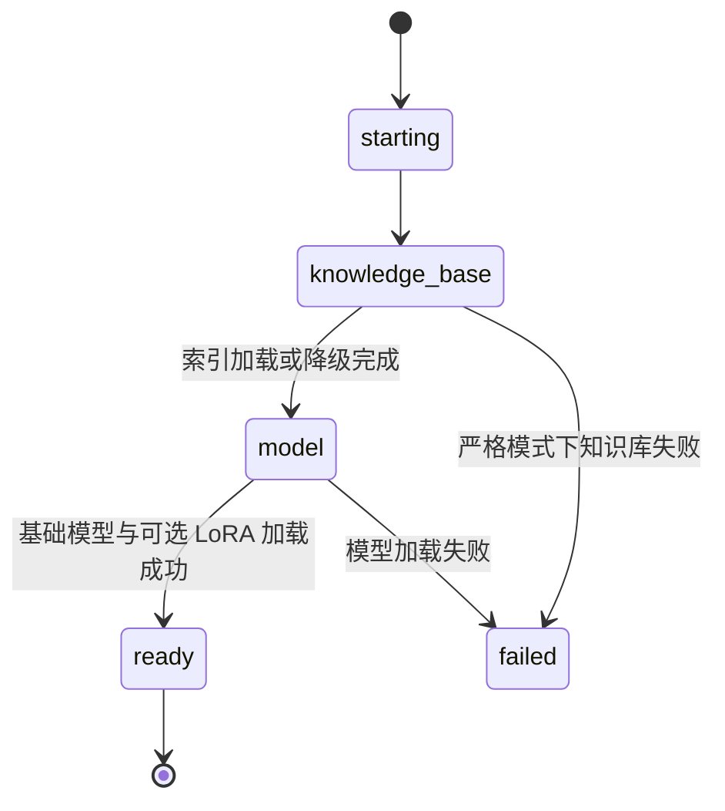
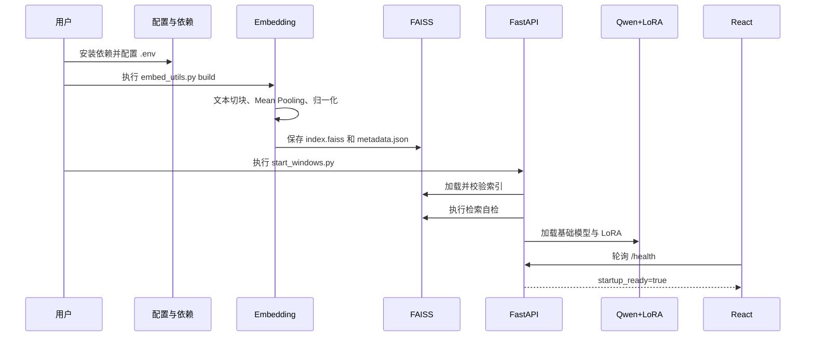
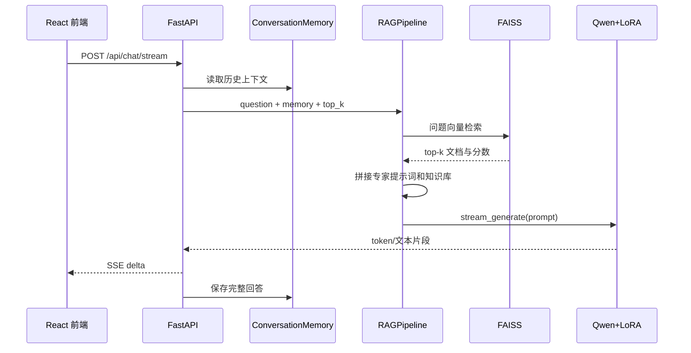

# 项目代码说明

## 1. 文档说明

本文档面向项目汇报、代码审查和后续维护人员，对本地运动健康垂直领域问答系统的代码框架进行完整解构。内容以当前仓库代码为准，覆盖环境配置、数据处理、向量知识库、RAG、LoRA/QLoRA 训练、本地模型推理、FastAPI 后端、React 前端、启动脚本和自动化测试。

代码量统一采用物理行数（Physical Lines）统计，即包含代码、注释和空行。该口径便于复核，但不等同于有效代码行数。统计范围不包含以下自动生成或大体积产物：

- `frontend/node_modules/`
- `frontend/dist/`
- `frontend/package-lock.json`
- `models/qwen/` 中的模型权重
- `embeddings/faiss_index/` 中的向量索引
- `logs/` 中的运行日志
- JSON 训练数据本身

统计日期：2026-06-22。

---

## 2. 项目目标与总体架构

本项目用于构建一个可在本地 Windows 计算机上运行的运动健康领域问答系统。系统将本地专业资料、监督微调数据、FAISS 向量检索、Qwen 基础模型和 LoRA 适配器组合起来，实现以下能力：

1. 对运动健康资料进行清洗、切块和向量化。
2. 将向量和文本元数据持久化到本地。
3. 根据用户问题检索相关资料。
4. 将检索结果、历史对话和用户问题组成 RAG 提示词。
5. 使用本地 Qwen 模型和 LoRA 参数生成回答。
6. 通过 FastAPI 提供普通接口和 SSE 流式接口。
7. 通过 React 前端展示系统状态、回答、思考过程和召回来源。
8. 使用自定义 PyTorch 训练循环完成 LoRA/QLoRA 微调。

总体调用关系如下：



---

## 3. 代码规模统计

### 3.1 模块级代码量

| 模块 | 主要目录或文件 | 物理行数 | 占源码与测试的比例 | 主要职责 |
|---|---|---:|---:|---|
| 后端服务 | `backend/` | 1,094 | 23.4% | API、启动状态、RAG 编排、模型推理、会话记忆 |
| 向量知识库 | `embeddings/` | 666 | 14.2% | 文本切块、Transformer 编码、FAISS 建库与查询 |
| 模型训练与独立推理 | `models/` | 619 | 13.2% | LoRA/QLoRA 训练、本地模型命令行测试 |
| 公共工具 | `utils/` | 385 | 8.2% | 配置、数据加载、提示词、语料清洗、日志 |
| React 前端源码 | `frontend/src/` | 1,198 | 25.6% | 页面、SSE 消费、Markdown、来源展示、响应式样式 |
| 自动化测试 | `tests/` | 720 | 15.4% | 后端、RAG、模型、Embedding、数据和启动脚本测试 |
| **合计** | 核心源码与测试 | **4,682** | **100%** | 不含启动脚本和配置清单 |

此外：

| 类型 | 文件 | 行数 |
|---|---|---:|
| Windows 启动脚本 | `start_windows.py` | 194 |
| macOS/Linux 启动脚本 | `run.sh` | 29 |
| 启动脚本合计 |  | **223** |
| 环境与项目配置 | `.env.example`、依赖文件、`pyproject.toml`、前端清单等 | 113 |

核心源码、测试和启动脚本合计约 **4,905 行**。

### 3.2 文件级代码量

#### 后端代码

| 文件 | 行数 | 说明 |
|---|---:|---|
| `backend/app.py` | 354 | FastAPI 应用、启动生命周期、健康检查、普通与流式聊天接口 |
| `backend/llm.py` | 266 | 本地模型和 LoRA 加载、普通生成、流式生成 |
| `backend/rag.py` | 314 | 检索器、RAG 开关、普通对话识别、提示词和回答编排 |
| `backend/memory.py` | 93 | 线程安全的多轮会话存储和历史压缩 |
| `backend/schemas.py` | 67 | Pydantic 请求和响应结构 |
| **合计** | **1,094** |  |

#### 向量知识库和模型代码

| 文件 | 行数 | 说明 |
|---|---:|---|
| `embeddings/embed_utils.py` | 666 | Embedding、FAISS、索引校验和命令行入口 |
| `models/train_lora.py` | 556 | LoRA/QLoRA 自定义训练循环 |
| `models/run_local_model.py` | 63 | 不启动 Web 服务的本地模型测试入口 |
| **合计** | **1,285** |  |

#### 公共工具代码

| 文件 | 行数 | 说明 |
|---|---:|---|
| `utils/data_loader.py` | 179 | 数据标准化、划分、SFT 格式化、知识库语料读取 |
| `utils/config.py` | 114 | `.env` 配置读取、字段校验和路径解析 |
| `utils/prepare_corpus.py` | 59 | 原始语料清洗和目录同步 |
| `utils/logging_utils.py` | 20 | 通用日志格式 |
| `utils/prompts.py` | 7 | 运动健康专家系统提示词 |
| `utils/embedding_defaults.py` | 6 | Embedding 默认模型、设备和批大小 |
| **合计** | **385** |  |

#### 前端代码

| 文件 | 行数 | 说明 |
|---|---:|---|
| `frontend/src/pages/index.jsx` | 401 | 主页面、健康轮询、SSE 解析、RAG 状态和交互 |
| `frontend/src/styles/global.css` | 610 | 三栏工作台、消息、状态、响应式布局 |
| `frontend/src/components/MarkdownMessage.jsx` | 132 | Markdown 和 `<think>` 思考块渲染 |
| `frontend/src/components/SourceList.jsx` | 24 | FAISS 召回来源列表 |
| `frontend/src/components/ChatMessage.jsx` | 21 | 用户与助手消息组件 |
| `frontend/src/App.jsx` | 10 | React 应用挂载入口 |
| **合计** | **1,198** |  |

#### 测试代码

| 文件 | 行数 | 说明 |
|---|---:|---|
| `tests/test_app.py` | 252 | API、启动状态、RAG/LoRA 开关、知识库降级和模型预加载 |
| `tests/test_embed_utils.py` | 150 | 切块、指纹、编码、索引保存与读取 |
| `tests/test_llm.py` | 96 | LoRA 挂载和适配器文件校验 |
| `tests/test_data_loader.py` | 82 | 数据标准化、划分、提示词和 JSON 语料 |
| `tests/test_rag.py` | 100 | RAG 提示词、上下文截断、双开关和检索失败回退 |
| `tests/test_memory.py` | 29 | 会话压缩和清空 |
| `tests/test_start_windows.py` | 11 | Windows 原生异常码解释 |
| **合计** | **720** | 共 34 个测试函数 |

---

## 4. 目录结构及职责

```text
deep_learning_project/
├─ backend/                 # FastAPI、模型调用、RAG、会话和接口结构
├─ data/
│  ├─ raw/                 # 原始资料
│  ├─ processed/           # 清洗后可参与知识库构建的资料
│  └─ finetune/            # 监督微调数据
├─ embeddings/
│  ├─ embed_utils.py       # 向量编码、FAISS 建库和查询
│  └─ faiss_index/         # 本地持久化索引，不提交 Git
├─ frontend/               # React 18 + Vite 前端
├─ models/
│  ├─ train_lora.py        # LoRA/QLoRA 训练
│  ├─ run_local_model.py   # 命令行模型测试
│  └─ qwen/                # 基础模型和 LoRA 参数，不提交 Git
├─ tests/                  # 不依赖真实模型权重的测试
├─ utils/                  # 配置、数据、提示词和语料工具
├─ start_windows.py        # Windows 前后端启动器
├─ run.sh                  # macOS/Linux 启动器
├─ .env.example            # 环境变量模板
├─ requirements*.txt       # Python 依赖
└─ environment.yml         # Conda 环境定义
```

---

## 5. 环境与配置代码

### 5.1 配置文件关系

项目使用四类环境配置：

| 文件 | 行数 | 用途 |
|---|---:|---|
| `.env.example` | 22 | 运行参数模板，复制为 `.env` 后生效 |
| `utils/config.py` | 114 | 将环境变量解析成类型安全的 `Settings` 对象 |
| `requirements.txt` | 15 | 通用环境及训练依赖 |
| `requirements-windows.txt` | 12 | Windows 部署依赖 |
| `environment.yml` | 22 | Conda 环境定义 |
| `pyproject.toml` | 4 | pytest 搜索路径和默认参数 |
| `frontend/package.json` | 19 | React、Vite 和图标依赖 |

### 5.2 `.env` 主要参数

| 配置项 | 默认值 | 作用 |
|---|---|---|
| `USE_LOCAL_MODEL` | `true` | 是否加载本地生成模型 |
| `LOCAL_MODEL_PATH` | `models/qwen/Qwen3.5-9B` | 基础模型目录 |
| `USE_LORA_ADAPTER` | `true` | 是否在基础模型上挂载 LoRA adapter |
| `LOCAL_LORA_ADAPTER_PATH` | `models/qwen/lora_adapter` | LoRA 参数目录 |
| `EMBEDDING_MODEL` | `sentence-transformers/paraphrase-multilingual-MiniLM-L12-v2` | Embedding 模型名称或本地目录 |
| `EMBEDDING_DEVICE` | `cpu` | Embedding 推理设备 |
| `EMBEDDING_BATCH_SIZE` | `32` | 向量编码批大小 |
| `FAISS_THREADS` | `1` | FAISS OpenMP 线程数 |
| `USE_RAG` | `true` | 是否加载知识库并对专业问题执行检索 |
| `KNOWLEDGE_BASE_SELF_TEST_QUERY` | `什么是体适能？` | 后端启动时的检索自检问题 |
| `RETRIEVAL_FAILURE_FALLBACK` | `true` | 知识库异常时是否允许模型继续工作 |
| `LOCAL_MODEL_MAX_NEW_TOKENS` | `2048` | 最大生成 token 数 |
| `LOCAL_MODEL_TEMPERATURE` | `0.2` | 采样温度 |
| `LOCAL_MODEL_TOP_P` | `0.9` | nucleus sampling 参数 |
| `LOCAL_MODEL_ENABLE_THINKING` | `false` | 默认是否开启深度思考 |
| `HTTP_PROXY` / `HTTPS_PROXY` | `127.0.0.1:7897` | Hugging Face 下载代理 |
| `BACKEND_PORT` / `FRONTEND_PORT` | `8000` / `5173` | 服务端口 |

`utils/config.py` 使用 Pydantic Settings 读取根目录 `.env`：

```python
model_config = SettingsConfigDict(
    env_file=PROJECT_ROOT / ".env",
    env_file_encoding="utf-8",
    extra="ignore",
)
```

路径字段通过验证器统一解析为项目根目录下的绝对路径，避免程序依赖当前终端所在目录：

```python
if value.is_absolute():
    return value
return PROJECT_ROOT / value
```

### 5.3 Python 依赖设计

通用环境主要包括：

- `torch`、`transformers`：基础模型、Embedding 和生成推理。
- `peft`：LoRA 参数训练与挂载。
- `bitsandbytes`：QLoRA 4-bit 量化。
- `faiss-cpu`：向量索引。
- `fastapi`、`uvicorn`：后端服务。
- `pydantic-settings`：环境配置。
- `swanlab`：训练指标记录。
- `pytest`、`httpx`：测试。

Windows 依赖文件不直接安装 `torch` 和 `faiss-cpu`，因为这两项通常需要分别根据 CUDA 版本和 Conda 平台安装。`numpy` 固定为 `1.26.4`，用于降低 Windows 二进制扩展的 ABI 冲突风险。

### 5.4 前端环境

前端使用：

- React 18
- React DOM 18
- Vite 5
- Lucide React 图标库

Vite 配置中的 `base: "./"` 使构建产物可使用相对路径，兼容静态部署：

```javascript
export default defineConfig({
  base: "./",
  plugins: [react()],
});
```

---

## 6. 数据处理代码

### 6.1 当前数据规模

| 数据文件 | 记录数或行数 | 用途 |
|---|---:|---|
| `data/dataset.json` | 1 条记录 | 小型示例数据 |
| `data/processed/dataset.json` | 95 条记录 | 知识库语料 |
| `data/processed/dataset01.json` | 211 条记录 | 扩展知识库语料 |
| `data/finetune/sft_dataset_clean.json` | 6,486 条记录 | LoRA 训练并默认参与知识库构建 |
| `data/processed/知识文本.txt` | 89 行 | 文本知识资料 |
| `data/raw/知识文本.txt` | 90 行 | 原始文本资料 |

训练数据总大小约 2.9 MB。数据文件行数和记录数不计入程序代码量。

### 6.2 数据标准化

`utils/data_loader.py` 将不同字段名统一为以下结构：

```json
{
  "instruction": "根据专业知识回答用户问题",
  "input": "用户问题",
  "output": "标准答案",
  "metadata": {}
}
```

兼容字段包括：

- 输入：`input`、`question`、`query`
- 输出：`output`、`answer`、`response`

核心逻辑为：

```python
user_input = record.get("input") or record.get("question") or record.get("query") or ""
output = record.get("output") or record.get("answer") or record.get("response") or ""
```

缺少输入或答案的记录会抛出 `ValueError`，避免无效样本进入训练或知识库。

### 6.3 数据集划分

`split_records()` 使用固定随机种子进行可复现划分：

```python
random.Random(seed).shuffle(items)
```

训练代码默认比例为：

- 训练集：90%
- 验证集：10%
- 测试集：剩余部分
- 随机种子：42

### 6.4 SFT 提示词格式

系统优先使用模型 tokenizer 自带的 `chat_template`。当模板不可用时，回退为 ChatML：

```text
<|im_start|>system
运动健康专家系统提示词
<|im_end|>
<|im_start|>user
指令和问题
<|im_end|>
<|im_start|>assistant
标准答案
<|im_end|>
```

训练、直接推理和 RAG 共用 `utils/prompts.py` 中的运动健康专家角色，避免不同环节出现身份不一致。

### 6.5 语料清洗

`utils/prepare_corpus.py` 对 `.txt`、`.md` 和 `.csv` 文件执行：

1. 换行符统一。
2. 连续空格合并。
3. 三个以上连续空行压缩。
4. 保留原始目录层级写入 `data/processed/`。

JSON 和 JSONL 文件不经过文本清洗，而是由 `read_corpus_files()` 解析为“来源、问题、答案”形式。

`to_dataset_dict()` 是一个可选的兼容辅助函数，可在额外安装 Hugging Face `datasets`
后将划分结果转换为 `DatasetDict`。当前 LoRA 自定义训练循环不调用该函数，也不依赖
`datasets`。

---

## 7. 向量知识库代码

向量知识库的主体位于 `embeddings/embed_utils.py`，共 666 行，可划分为以下部分：

| 大致代码范围 | 内容 |
|---|---|
| 1—52 行 | 项目路径、代理变量加载、公共导入 |
| 53—95 行 | 索引常量和数据结构 |
| 97—155 行 | Transformer Mean Pooling 编码器 |
| 157—239 行 | 语料指纹、切块和多来源合并 |
| 240—545 行 | `FaissKnowledgeBase` 构建、保存、校验、加载和查询 |
| 547—666 行 | `build/query/status` 命令行入口 |

### 7.1 下载环境加载

建库脚本只从 `.env` 读取下载相关变量：

- `HTTP_PROXY`
- `HTTPS_PROXY`
- `NO_PROXY`
- `HF_HUB_DISABLE_XET`
- `HF_HUB_OFFLINE`

该实现不依赖 `python-dotenv`，因此 Embedding 命令行入口保持较小依赖面。

### 7.2 Embedding 编码器

项目不导入 `sentence-transformers` Python 包，而是通过 `AutoTokenizer` 和 `AutoModel` 直接加载 MiniLM。模型名称中的 `sentence-transformers/` 只是 Hugging Face 仓库命名空间。

编码流程：

1. tokenizer 完成 padding、截断和 Tensor 转换。
2. Transformer 输出每个 token 的隐藏状态。
3. 使用 attention mask 排除 padding token。
4. 对有效 token 执行均值池化。
5. 对句向量进行 L2 归一化。

核心代码：

```python
token_embeddings = output.last_hidden_state
attention_mask = encoded["attention_mask"].unsqueeze(-1)

sentence_embeddings = (
    (token_embeddings * attention_mask).sum(dim=1)
    / attention_mask.sum(dim=1).clamp(min=1)
)

sentence_embeddings = torch.nn.functional.normalize(
    sentence_embeddings,
    p=2,
    dim=1,
)
```

对应数学表达式：

\[
e = \frac{\sum_{i=1}^{n} m_i h_i}{\sum_{i=1}^{n} m_i}
\]

其中，\(h_i\) 为第 \(i\) 个 token 的隐藏向量，\(m_i\) 为 attention mask。随后对 \(e\) 进行 L2 归一化。

### 7.3 文本切块

默认参数：

- `chunk_size = 600`
- `overlap = 80`
- 实际步长 `step = 520`

重叠区域用于减少专业概念被切断后造成的上下文丢失：

```python
step = chunk_size - overlap
for start in range(0, len(text), step):
    chunk = text[start:start + chunk_size].strip()
```

### 7.4 多来源建库

默认建库来源为：

1. `data/processed/`
2. `data/finetune/sft_dataset_clean.json`

因此，微调数据中的标准问答也可作为 RAG 检索资料。每个文本块保存：

```python
DocumentChunk(
    id=编号,
    source=来源文件,
    text=文本内容,
)
```

### 7.5 语料指纹

`build_source_signature()` 对以下信息计算 SHA-256：

- Embedding 模型名称
- 切块长度
- 重叠长度
- 语料文件路径
- 语料文件内容

该指纹用于判断数据或配置是否发生变化。

### 7.6 FAISS 索引

向量归一化后，系统使用内积索引：

```python
index = faiss.IndexFlatIP(embeddings.shape[1])
index.add(embeddings)
```

对于 L2 归一化向量，内积等价于余弦相似度。因此检索得分越高，问题和文本块越相似。

构建结果保存在：

```text
embeddings/faiss_index/index.faiss
embeddings/faiss_index/metadata.json
```

`index.faiss` 保存向量；`metadata.json` 保存：

- 索引格式版本
- 构建时间
- Embedding 模型
- 向量维度
- 语料指纹
- 数据来源
- 切块参数
- 文本块内容

### 7.7 安全写入与校验

系统先写入临时文件：

```text
index.faiss.tmp
metadata.json.tmp
```

临时文件通过格式、模型、向量维度和条目数量校验后，再使用 `os.replace()` 替换正式文件。这样可以降低构建过程中断导致正式索引损坏的风险。

### 7.8 查询流程

查询时执行：

```python
query_vector = self.encode([query])
scores, indices = self._index.search(query_vector, effective_top_k)
```

文档和问题使用完全相同的编码器和归一化方式。查询结果增加 `score` 字段后交给 RAG 模块。

### 7.9 命令行接口

```powershell
python embeddings/embed_utils.py build
python embeddings/embed_utils.py status
python embeddings/embed_utils.py query "什么是体适能？" --top_k 3
```

- `build`：构建并持久化索引。
- `status`：读取索引信息，不重新编码。
- `query`：执行一次真实检索。

后端启动不会自动重建知识库，只读取已有索引并进行自检。

---

## 8. RAG 代码

RAG 主体位于 `backend/rag.py`，共 314 行。

### 8.1 检索器封装

`FaissRetriever` 对 `FaissKnowledgeBase` 进行延迟初始化。只有第一次加载或查询时才导入 Embedding 模块：

```python
if self._kb is None:
    from embeddings.embed_utils import FaissKnowledgeBase
```

该设计减少 FastAPI 模块导入阶段的资源占用。

### 8.2 普通对话与专业问题分流

`is_small_talk()` 识别“你好”“谢谢”“你是谁”等短消息。普通寒暄不访问 FAISS：

```python
if self.is_small_talk(question):
    documents = []
    prompt = self.build_chat_prompt(...)
else:
    documents = self.retrieve(question, top_k=top_k)
    prompt = self.build_prompt(...)
```

这样可以降低无意义检索，也避免普通问候出现“未检索到知识库”等机械回答。

### 8.3 RAG 提示词

专业问题的提示词包含四部分：

1. 运动健康专家系统提示词。
2. 多轮对话记忆。
3. FAISS 召回文本及来源。
4. 当前用户问题和回答约束。

每条检索结果格式为：

```text
[文档 1] 来源: 文件路径 | score=0.8231
文档内容
```

### 8.4 上下文长度控制

默认最大上下文字符数为 6,000。代码将其划分为：

- 约三分之一用于历史记忆。
- 其余部分用于检索资料。

这可以避免过长知识库内容挤占用户问题和生成空间。

### 8.5 检索失败回退

当 `RETRIEVAL_FAILURE_FALLBACK=true` 时，FAISS 查询异常会返回空文档，模型仍能直接回答：

```python
except Exception:
    if settings.retrieval_failure_fallback:
        return []
    raise
```

此时健康接口显示 `degraded`，但聊天服务仍可使用。

### 8.6 RAG 启用开关

`USE_RAG=false` 时，后端启动跳过 FAISS 加载和检索自检，`RAGPipeline` 将
`use_rag` 和 `_retrieval_enabled` 同时设为 `false`。所有问题使用
`build_direct_prompt()` 直接交给基础模型或 LoRA，提示词不包含“本地知识库”段落。

关闭 RAG 不会修改或删除 `index.faiss` 和 `metadata.json`。重新启用并重启服务后，
系统会再次读取原有索引。

---

## 9. 本地模型推理代码

模型推理位于 `backend/llm.py`，共 266 行。

### 9.1 客户端抽象

`LLMClient` Protocol 统一规定：

- `load()`
- `generate()`
- `stream_generate()`

当 `USE_LOCAL_MODEL=false` 时，系统使用 `PlaceholderLLMClient`，便于不加载权重测试 API 和 RAG 提示词。

### 9.2 模型加载阶段

`TransformersLLMClient` 将加载过程划分为六个阶段：

1. 检查基础模型和 LoRA 路径。
2. 导入 PyTorch 与 Transformers。
3. 加载 tokenizer。
4. 加载基础模型。
5. 当 `USE_LORA_ADAPTER=true` 时，通过 PEFT 挂载 LoRA adapter。
6. 设置评估模式并完成初始化。

LoRA 目录必须包含：

```text
adapter_config.json
adapter_model.safetensors
```

或者使用 `adapter_model.bin`。

`USE_LORA_ADAPTER` 控制是否挂载 LoRA。设置为 `false` 时，
`active_lora_adapter_path` 返回 `None`，模型客户端只加载基础模型；配置路径和 adapter
文件仍然保留，重新设置为 `true` 并重启后端即可恢复 LoRA。

### 9.3 设备与精度

```python
dtype = torch.bfloat16 if torch.cuda.is_available() else torch.float32
device_map = "auto" if torch.cuda.is_available() else None
```

GPU 环境使用 BF16 和自动设备映射；CPU 回退使用 FP32。

### 9.4 LoRA 挂载

```python
self._model = PeftModel.from_pretrained(
    self._model,
    str(self.lora_adapter_path),
    local_files_only=self.local_files_only,
)
```

基础模型保持不变，推理时通过 PEFT 组合 LoRA 增量参数。

### 9.5 提示词与生成参数

系统通过 tokenizer 的 `apply_chat_template()` 组织 system 和 user 消息。主要生成参数包括：

- `max_new_tokens`
- `temperature`
- `top_p`
- `repetition_penalty = 1.05`
- `eos_token_id`
- `pad_token_id`

当温度为 0 时采用确定性生成；温度大于 0 时开启采样。

### 9.6 流式输出

流式生成使用 `TextIteratorStreamer`，模型生成运行在线程中，主线程持续迭代文本片段：

```python
streamer = TextIteratorStreamer(...)
thread = Thread(target=self._model.generate, ...)
thread.start()

for text in streamer:
    yield text
```

`RLock` 保证同一个模型实例不会同时执行多个生成任务，降低显存竞争和线程安全风险。

---

## 10. LoRA/QLoRA 训练代码

训练主体位于 `models/train_lora.py`，共 556 行。

### 10.1 代码结构

| 大致代码范围 | 内容 |
|---|---|
| 1—66 行 | 环境变量、路径、日志和默认训练参数 |
| 67—110 行 | 专家提示词和消息格式 |
| 111—184 行 | Tokenization、标签掩码、批处理和数据预览 |
| 185—261 行 | CUDA 校验、精度选择、基础模型和 QLoRA 配置 |
| 262—304 行 | SwanLab、验证损失和 adapter 保存 |
| 305—481 行 | 完整训练循环 |
| 482—556 行 | 命令行参数和错误处理 |

### 10.2 默认训练参数

| 参数 | 默认值 |
|---|---|
| 基础模型 | `models/qwen/Qwen3.5-9B` |
| 数据集 | `data/finetune/sft_dataset_clean.json` |
| 输出目录 | `models/qwen/lora_adapter` |
| Epoch | 1 |
| 学习率 | `2e-4` |
| Warmup ratio | `0.03` |
| 单设备 batch size | 1 |
| 梯度累积 | 8 |
| 最大序列长度 | 1024 |
| 最大梯度范数 | 1.0 |
| LoRA rank | 16 |
| LoRA alpha | 32 |
| LoRA dropout | 0.05 |
| 精度 | BF16 |
| 梯度检查点 | 开启 |

### 10.3 LoRA 目标模块

默认适配以下线性层：

```text
q_proj, k_proj, v_proj, o_proj,
gate_proj, up_proj, down_proj
```

既覆盖注意力投影，也覆盖前馈网络投影。

### 10.4 训练标签和损失

系统提示词和用户输入被设置为 `-100`，不参与交叉熵损失：

```python
labels = [-100] * prompt_length + input_ids[prompt_length:]
```

Padding 同样填充为 `-100`。因此，损失只计算 assistant 标准答案部分。

训练目标为因果语言模型交叉熵：

\[
\mathcal{L}
=-\frac{1}{N}\sum_{t=1}^{N}
\log P(y_t\mid y_{<t},x)
\]

其中，\(x\) 为系统提示词和用户问题，\(y_t\) 为答案 token。

### 10.5 自定义训练循环

项目没有使用 Hugging Face `Trainer`，而是直接使用 PyTorch：

```python
outputs = model(**batch)
raw_loss = outputs.loss
loss = raw_loss / args.gradient_accumulation_steps
loss.backward()
```

原因是部分 Windows 环境在导入 `Trainer/datasets/pyarrow` 时发生原生访问冲突。自定义循环减少了复杂依赖，并允许直接控制训练过程。

每次优化器更新前执行梯度裁剪：

```python
grad_norm = torch.nn.utils.clip_grad_norm_(
    trainable_params,
    args.max_grad_norm,
)
```

首个优化步骤还会检查梯度是否为 0、NaN 或无穷大，防止 LoRA 参数没有接入损失计算。

### 10.6 优化器与学习率

- 优化器：`torch.optim.AdamW`
- 调度器：线性 warmup + 线性衰减
- Warmup 步数：`total_steps × warmup_ratio`

日志中的 `loss` 使用未除以梯度累积步数的原始平均损失，便于真实观察训练趋势。

### 10.7 验证、日志和检查点

训练代码支持：

- 每 `logging_steps` 输出训练损失、学习率和梯度范数。
- CUDA 环境记录已使用显存。
- 每 `eval_steps` 计算验证损失。
- 每 `save_steps` 保存 checkpoint。
- 训练结束保存最终 LoRA adapter 和 tokenizer。
- 使用 SwanLab 记录实验指标。
- Python 异常写入 `logs/train_lora_debug.log`。

### 10.8 QLoRA

使用 `--use_qlora` 时启用：

```python
BitsAndBytesConfig(
    load_in_4bit=True,
    bnb_4bit_quant_type="nf4",
    bnb_4bit_use_double_quant=True,
)
```

QLoRA 可降低显存占用，但依赖 `bitsandbytes` 和可用 CUDA 环境。

### 10.9 训练命令

```powershell
# 数据和 tokenizer 冒烟测试，不加载完整训练流程
python models/train_lora.py --dry_run --max_samples 3

# 小样本训练测试
python models/train_lora.py --no_swanlab --max_samples 32 --epochs 3 --logging_steps 1

# 正式训练
python models/train_lora.py
```

---

## 11. FastAPI 后端代码

`backend/app.py` 是系统后端入口，共 354 行。

### 11.1 全局对象

后端初始化两个核心对象：

```python
memory = ConversationMemory(...)
rag_pipeline = RAGPipeline()
```

同时维护线程安全的 `startup_state`，记录：

- 当前启动阶段
- 是否可以接收请求
- 模型是否加载
- 知识库是否可用
- 知识库条目数量
- 初始化错误

### 11.2 启动状态机



实际启动顺序：

1. FastAPI 先开放 `/health`。
2. 当 `USE_RAG=true` 时，后台线程读取本地 FAISS 索引。
3. 当 `USE_RAG=true` 时，使用固定问题执行检索自检。
4. 加载 Qwen 基础模型。
5. 根据 `USE_LORA_ADAPTER` 决定是否挂载 LoRA adapter。
6. 将 `startup_ready` 设置为 `true`。

知识库失败且允许回退时，系统继续加载模型并进入 `degraded` 状态。

### 11.3 API 接口

| 方法 | 路径 | 作用 |
|---|---|---|
| GET | `/health` | 返回启动、模型和知识库状态 |
| GET | `/api/config` | 返回前端需要的运行配置 |
| POST | `/api/model/test` | 绕过 RAG，直接测试本地模型和 LoRA |
| POST | `/api/sessions` | 创建会话 |
| POST | `/api/chat` | 非流式问答 |
| POST | `/api/chat/stream` | SSE 流式问答 |
| POST | `/api/sessions/{id}/clear` | 清空会话上下文 |

### 11.4 SSE 事件

流式接口发送四类事件：

| 事件 | 数据 | 作用 |
|---|---|---|
| `meta` | `session_id`、`documents` | 建立会话并展示检索来源 |
| `delta` | 文本片段 | 增量显示模型回答 |
| `done` | 完整答案 | 表示生成结束 |
| `error` | 错误信息 | 前端显示失败原因 |

SSE 格式由以下函数统一生成：

```python
return f"event: {event}\ndata: {payload}\n\n"
```

### 11.5 请求就绪控制

聊天和模型测试接口调用 `require_runtime_ready()`。模型尚未准备完成时返回 HTTP 503，前端不会将其误报为普通网络错误。

---

## 12. 多轮会话代码

`backend/memory.py` 共 93 行，使用两个字典分别保存：

- 当前会话的最近消息。
- 被压缩的历史摘要。

每个会话使用 UUID：

```python
session_id = str(uuid4())
```

默认保留最近 6 轮，即最多 12 条用户/助手消息。超过数量后，旧消息转入文本摘要：

```python
old_messages = messages[:-max_messages]
self._summaries[session_id] = ...
self._sessions[session_id] = messages[-max_messages:]
```

`RLock` 用于保护创建、写入、读取和清空操作。当前会话只保存在内存中，后端重启后不会保留。

---

## 13. 前端代码

前端源码共 1,198 行，其中 610 行为样式，588 行为 React/JavaScript 逻辑。

### 13.1 页面结构

主页面采用三栏布局：

1. 左侧：系统名称、Top-K 参数、对话统计、清空按钮。
2. 中间：启动状态、消息列表、输入框、深度思考和发送按钮。
3. 右侧：FAISS 召回来源。

### 13.2 后端健康轮询

页面每 1.5 秒请求 `/health`，单次请求超时为 2.5 秒：

```javascript
timerId = window.setTimeout(checkHealth, 1500);
const timeoutId = window.setTimeout(() => controller.abort(), 2500);
```

界面区分：

- 等待后端
- 知识库校验中
- 模型加载中
- 系统就绪
- 降级运行
- 初始化失败

只有 `startup_ready=true` 时才允许发送消息。

### 13.3 SSE 解析

`parseSseChunk()` 按空行拆分事件块，并解析 `event:` 和 `data:` 字段。页面收到：

- `meta`：更新会话 ID 和来源。
- `delta`：追加到当前助手消息。
- `error`：抛出错误并显示提示。

### 13.4 消息状态

流式回答使用临时标识：

```javascript
const ASSISTANT_STREAM_KEY = "assistant-streaming";
```

每个 `delta` 到达时，只更新带该标识的助手消息。生成完成后移除临时标识，将消息转为普通历史消息。

### 13.5 Markdown 与思考块

`MarkdownMessage.jsx` 支持：

- 一级至三级标题
- 无序列表
- 粗体、斜体和行内代码
- 代码块
- `<think>...</think>` 思考内容

在插入 HTML 前先执行字符转义：

```javascript
.replace(/&/g, "&amp;")
.replace(/</g, "&lt;")
.replace(/>/g, "&gt;")
```

随后再将受支持的 Markdown 语法转换为 HTML，降低直接渲染模型输出带来的风险。

### 13.6 响应式样式

`global.css` 共 610 行，主要断点：

- `max-width: 1120px`：收缩三栏布局。
- `max-width: 760px`：适配窄屏和移动端。

样式还覆盖：

- 消息气泡
- 状态颜色
- 加载动画
- 思考块
- 代码块
- 来源卡片
- 输入框禁用态

---

## 14. 启动脚本

### 14.1 Windows 启动器

`start_windows.py` 共 194 行，负责：

1. 读取 `.env`。
2. 检查 npm。
3. 缺少 `node_modules` 时执行 `npm install`。
4. 启动 Uvicorn。
5. 将后端输出写入 `logs/backend_startup.log`。
6. 启动 Vite 前端。
7. 监控子进程退出状态。
8. 将 Windows 原生异常码转换为可读描述。

例如：

```text
0xC0000005 -> access violation
0xC0000017 -> out of memory
0xC00000FD -> stack overflow
```

默认命令：

```powershell
python start_windows.py
```

仅启动后端：

```powershell
python start_windows.py --backend-only
```

### 14.2 macOS/Linux 启动器

`run.sh` 共 29 行，使用后台进程启动 Uvicorn 和 Vite，并通过 `trap` 在退出时清理两个进程。

---

## 15. 自动化测试

项目共有 34 个测试函数、720 行测试代码。测试不依赖真实 9B 权重，也不要求已有 FAISS 索引。

### 15.1 覆盖范围

| 测试模块 | 覆盖内容 |
|---|---|
| `test_app.py` | 健康接口、模型测试、启动阶段、知识库失败和降级运行 |
| `test_embed_utils.py` | SFT 数据入库、语料指纹、编码进度、标准编码、索引读写 |
| `test_llm.py` | LoRA adapter 加载和文件完整性 |
| `test_data_loader.py` | JSON/JSONL、字段标准化、划分、提示词、语料解析 |
| `test_rag.py` | 提示词、来源、上下文长度、检索失败回退 |
| `test_memory.py` | 历史压缩和会话清空 |
| `test_start_windows.py` | Windows 原生返回码 |

### 15.2 模拟依赖

测试使用 FakeModel、FakeRetriever 和 FakeFaiss 等对象替代真实模型和原生索引，从而验证业务逻辑而不消耗显存。

运行方式：

```powershell
pytest
```

`pyproject.toml` 已配置：

```toml
[tool.pytest.ini_options]
testpaths = ["tests"]
pythonpath = ["."]
addopts = "-q"
```

---

## 16. 系统完整运行流程

### 16.1 首次部署



### 16.2 一次专业问答



---

## 17. 主要输出产物

| 产物 | 路径 | 是否提交 Git |
|---|---|---|
| FAISS 索引 | `embeddings/faiss_index/index.faiss` | 否 |
| 知识库元数据 | `embeddings/faiss_index/metadata.json` | 否 |
| LoRA adapter | `models/qwen/lora_adapter/` | 否 |
| LoRA checkpoint | `models/qwen/lora_adapter/checkpoint-*` | 否 |
| 后端日志 | `logs/backend_startup.log` | 否 |
| 训练日志 | `logs/train_lora_debug.log` | 否 |
| 前端构建产物 | `frontend/dist/` | 否 |

---

## 18. 关键设计特点

### 18.1 本地优先

基础模型、LoRA、Embedding 缓存和 FAISS 索引均可保存在本地。首次下载 Embedding 模型后，可通过 `HF_HUB_OFFLINE=1` 离线运行。

### 18.2 建库与启动分离

知识库通过显式 `build` 命令生成，后端启动只负责读取和校验，不会重复编码 6,801 个或更多文本块。

### 18.3 训练与推理角色一致

统一的运动健康专家提示词同时用于：

- SFT 数据格式化
- LoRA 训练
- 直接模型推理
- RAG 提示词

### 18.4 Windows 稳定性适配

项目针对 Windows 做了以下处理：

- 不使用 Hugging Face Trainer。
- 不依赖 `sentence-transformers` Python 包进行 RAG 编码。
- 固定 NumPy 1.26.4。
- 后端日志写入文件。
- 启用 Python faulthandler。
- 显示 Windows 原生异常码含义。

### 18.5 可降级运行

知识库异常时，模型仍可启动并完成普通问答。该设计将“模型不可用”和“检索不可用”区分开，提高系统可用性。

---

## 19. 当前限制与后续改进方向

1. 会话历史仅保存在内存中，服务重启后丢失，可增加 SQLite 或 Redis。
2. 普通对话识别采用关键词规则，可改为轻量分类器。
3. Embedding 最大长度固定为 128 token，长文本主要依赖字符切块，可进一步按 tokenizer token 切块。
4. 当前 FAISS 使用精确内积检索，数据规模继续增长时可改用 HNSW 或 IVF。
5. 召回后没有 reranker，可增加交叉编码器进行二次排序。
6. Markdown 解析器为项目内简化实现，可替换为成熟 Markdown 组件并配置严格白名单。
7. API 没有身份认证，适合本机或可信局域网，不适合直接暴露到公网。
8. 当前训练数据和知识库数据存在部分复用，评估时需要避免训练集内容泄漏到测试问题。

---

## 20. 常用操作命令

### 环境安装

```powershell
conda activate DL_lyx
conda install -c conda-forge numpy=1.26.4 faiss-cpu -y
pip install -r requirements-windows.txt
```

### 语料准备

```powershell
python utils/prepare_corpus.py
```

### 知识库

```powershell
python embeddings/embed_utils.py build
python embeddings/embed_utils.py status
python embeddings/embed_utils.py query "什么是体适能？" --top_k 3
```

### 模型测试

```powershell
python models/run_local_model.py --prompt "请介绍你的专业领域"
```

### LoRA 训练

```powershell
python models/train_lora.py --dry_run --max_samples 3
python models/train_lora.py
```

### 系统启动

```powershell
python start_windows.py
```

### 自动化测试

```powershell
pytest
```

---

## 21. 总结

本项目已经形成一条完整的本地垂直领域问答链路：数据清洗与标准化负责提供高质量输入，Transformer Mean Pooling 与 FAISS 负责知识检索，自定义 LoRA 训练负责领域能力适配，Qwen 与 PEFT 负责本地生成，FastAPI 和 SSE 负责服务封装，React 前端负责交互和状态展示。

从代码规模看，项目的主要复杂度集中在前端交互、向量知识库、训练循环和后端服务四个部分。其中前端源码约占 25.6%，后端约占 23.4%，向量知识库与模型训练合计约占 27.4%。测试代码占 15.4%，说明项目已对关键业务流程建立了基础自动化验证。
